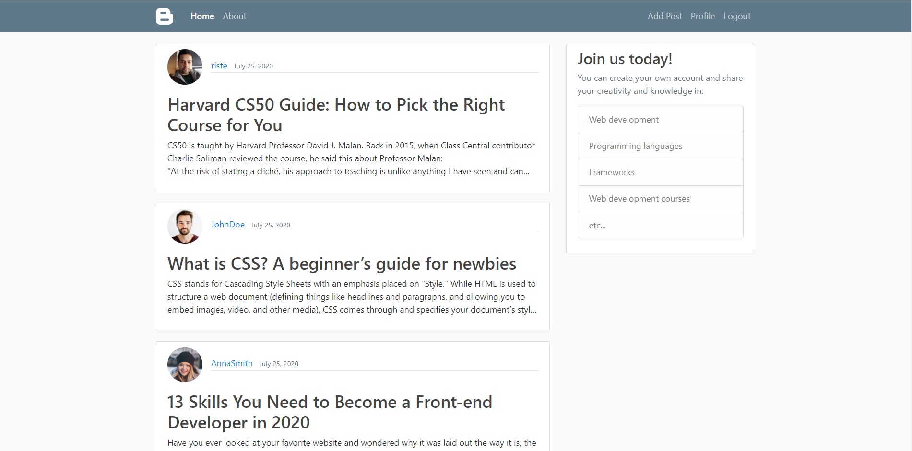
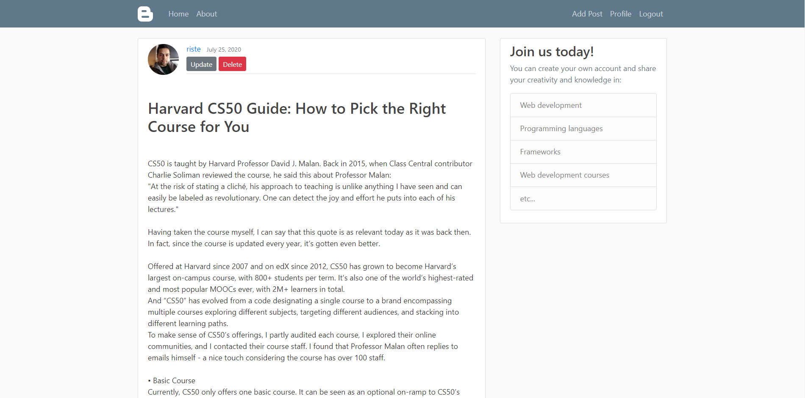
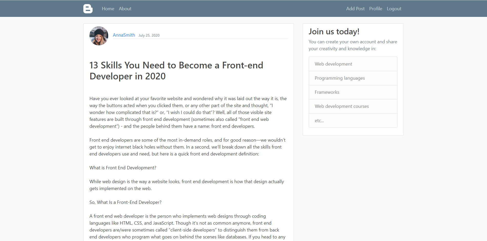
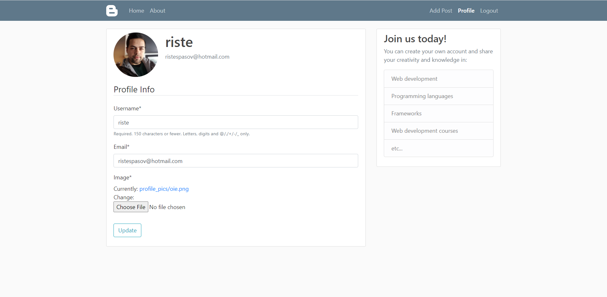
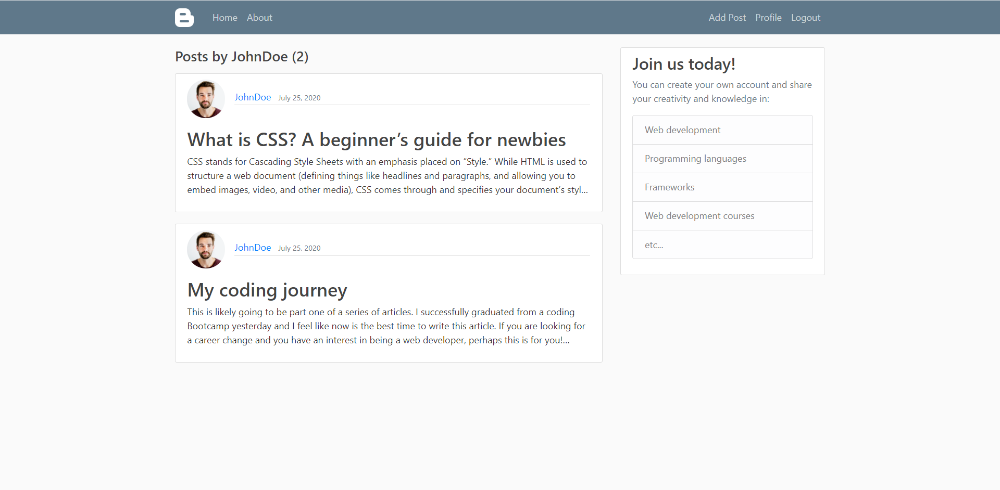

# BlogApp 

## About 

A Blog web application, written in Django. Users can register or log in if already have an existing account, reset their password via confirmation email, write/update/delete/post blog posts, update their profiles (picture, username, password, etc), read and check other user's posts, navigate through pages, etc.

Users can read posts even if they are not registered or logged in. 

## Technologies & Tools

- Django (Python)
- SQL
- Bootstrap 4.5
- PyCharm

## Includes

- Crispy Forms 
- Pillow
- Django CleanUp

## Some of the views

- Homepage 

- Selected post of logged user 
 

- Selected post of other users 

- Profile  

- Show all posts of user when selected

